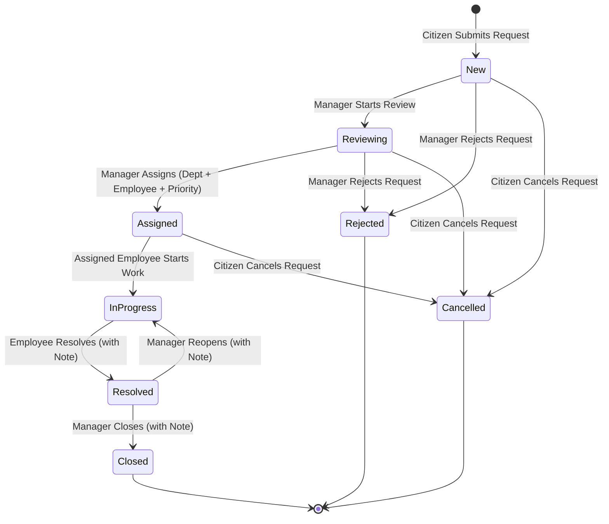

# Bursa Şehir Hizmetleri Yönetim Sistemi (BCSMS)

[](https://dotnet.microsoft.com/)
[](https://react.dev/)
[](https://www.typescriptlang.org/)
[](https://www.postgresql.org/)
[](https://www.docker.com/)


Sistem, vatandaşların hizmet taleplerini ilk başvuru anından itibaren belediye incelemesi, birim ataması, saha uygulaması, çözüm ve resmi kapatma süreçlerine kadar uçtan uca yönetir.

---

## İş Akışı Özeti

```
[Vatandaş] Talep Oluşturur ──► [Yönetici] İncelemeye Alır ──► [Yönetici] Birim & Personel Atar
                                                                       │
[Vatandaş] Bildirim Alır ◄── [Yönetici] Talebi Kapatır ◄── [Personel] Talebi Çözer ◄── [Personel] İşe Başlar
```

---

## Temel Özellikler

### Vatandaş Portalı
- **Kayıt ve Kimlik Doğrulama**: Güvenli şifre kurallarıyla vatandaş öz kayıt (self-registration) mekanizması.
- **Hizmet Talebi Oluşturma**: Aktif belediye kategorilerinden (`Yol ve Kaldırım`, `Sokak Aydınlatması ve Elektrik`, `Atık ve Temizlik`, `Park ve Yeşil Alanlar`) seçim yaparak açık adres ve coğrafi koordinat (enlem/boylam) ile talep oluşturma.
- **Taleplerim ve Takip**: Kişisel talepleri duruma göre filtreleme ve kronolojik süreç geçmişini detaylı inceleme.

### Yönetici Portalı
- **Belediye Talepleri Genel Görünümü**: Durum metriklerini içeren kapsamlı dashboard ve çoklu filtreleme (Durum, Kategori, Birim, Öncelik) destekli talep tablosu.
- **Süreç Yönetimi**: İnceleme başlatma (`New` $\rightarrow$ `Reviewing`), talepleri ilgili belediye birimlerine ve saha personeline öncelik puanıyla atama (`Reviewing` $\rightarrow$ `Assigned`), uygun olmayan talepleri reddetme (`Rejected`), çözülemeyen talepleri yeniden açma (`InProgress`), ve tamamlanan talepleri resmi olarak kapatma (`Closed`).

### Saha Personeli Portalı
- **Görev Yönetimi**: Giriş yapmış personele özel atanan talepleri listeleyen dinamik ekran.
- **Saha İş Yürütme**: Atanan görevleri aktif çalışmaya alma (`Assigned` $\rightarrow$ `InProgress`) ve iş tamamlandığında çözüm notuyla birlikte çözüldü olarak işaretleme (`InProgress` $\rightarrow$ `Resolved`).

### Platform ve Mimari
- **JWT Bearer Kimlik Doğrulama**: Rol tabanlı erişim kontrolü (`Citizen`, `Manager`, `Employee`, `Admin`).
- **Denetim İzleri ve Zaman Çizelgesi**: İşlemi yapan kullanıcı ID'si, zaman damgası ve notları içeren değiştirilemez (immutable) durum geçiş geçmişi.
- **Prodüksiyon Seviyesinde Konteynerizasyon**: Nginx reverse proxy ile multi-stage Dockerfile ve Docker Compose orkestrasyonu.
- **Standart Hata Yönetimi**: Tüm API denetleyicilerinde RFC 7807 `ProblemDetails` standart hata yanıtları.

---

## Sistem Mimarisi

BCSMS, **Clean Architecture** (Ports & Adapters) ilkelerine tam uyumlu olarak tasarlanmıştır:

```
BCSMS.API ───────► BCSMS.Application ◄─────── BCSMS.Infrastructure
                           │
                           ▼
                      BCSMS.Domain
```

- **`BCSMS.Domain`**: Temel kurumsal varlıklar (entities), değer nesneleri (value objects), domain istisnaları ve iş kuralları (dış framework bağımlılığı içermez).
- **`BCSMS.Application`**: Kullanım senaryoları (use cases), komut/sorgu işleyicileri (CQRS tarzı handlers), doğrulama mantığı, repository arayüzleri ve DTO'lar.
- **`BCSMS.Infrastructure`**: EF Core 8 veritabanı bağlamı (`BcsmsDbContext`), migrasyonlar, PostgreSQL repository uyarlamaları, PBKDF2 şifre özetleme (hashing) ve JWT token üretimi.
- **`BCSMS.API`**: ASP.NET Core Web API katmanı, ara yazılımlar (middleware), Swagger dokümantasyonu ve health check endpoint'leri.
- **`frontend/web`**: React 18, TypeScript, Material UI (MUI v5) ve TanStack Query v5 ile geliştirilmiş Single Page Application (SPA).

Detaylı mimari şemalar ve teknik dokümantasyon [docs/architecture/architecture.md](docs/architecture/architecture.md) dosyasında mevcuttur.

---

## Kullanılan Teknolojiler

| Katman | Teknolojiler |
|---|---|
| **Backend (Primary)** | .NET 8, ASP.NET Core Web API, EF Core 8, PostgreSQL 16 (Npgsql), xUnit, FluentAssertions, Moq |
| **Frontend** | React 18, TypeScript 5.5, Vite 5, Material UI (MUI v5), React Router v6, Axios, TanStack Query v5, Vitest, React Testing Library |
| **Altyapı & Konteyner** | Docker, Docker Compose, Nginx 1.27 Alpine |

---

## Domain Modeli ve Veritabanı Şeması

Veritabanı şeması belediye hizmet alanını yansıtmaktadır:

- **`Users`**: Sistem rolleri (`Citizen`, `Manager`, `Employee`, `Admin`) ve birim ilişkisi bulunan kullanıcı hesapları.
- **`Departments`**: Operasyonel belediye birimleri (Fen İşleri, Park ve Bahçeler, Temizlik İşleri, Ulaşım).
- **`Categories`**: Vatandaş başvuruları için hizmet kategorileri (`Yol ve Kaldırım`, `Sokak Aydınlatması ve Elektrik`, `Atık ve Temizlik`, `Park ve Yeşil Alanlar`).
- **`ServiceRequests`**: Takip kodu, vatandaş referansı, kategori, atanan personel, koordinat ve notları barındıran temel yaşam döngüsü varlığı.
- **`StatusHistoryEntries`**: Her durum geçişini, aktör ID'sini ve işlem notunu kaydeden değiştirilemez denetim kaydı.
- **`Comments`** & **`Attachments`**: Taleplere bağlı yorumlar ve dosya eki meta verileri.

Varlık İlişki Diyagramı (ERD) ve veritabanı detayları [docs/database/er-diagram.md](docs/database/er-diagram.md) dosyasında mevcuttur.

---

## Talep Yaşam Döngüsü (State Machine)



Detaylı durum geçiş kuralları ve rol yetkileri [docs/business/request-workflow.md](docs/business/request-workflow.md) dokümanında yer almaktadır.

---

## Roller ve Yetkilendirme

- **Vatandaş (`Citizen`)**: Yeni hizmet talebi oluşturabilir, kendi taleplerini listeleyebilir, talep sürecini takip edebilir ve henüz işleme alınmamış talebini iptal edebilir.
- **Yönetici (`Manager`)**: Tüm belediye taleplerini izleyebilir, inceleme başlatabilir, talebi birime/saha personeline atayabilir, öncelik belirleyebilir, uygun olmayan talepleri gerekçe ile reddedebilir veya tamamlanan talepleri kapatabilir/yeniden açabilir.
- **Saha Personeli (`Employee`)**: Kendisine atanan görevleri görüntüleyebilir, işi başlatabilir (`InProgress`) ve çözüm notu ekleyerek tamamlayabilir (`Resolved`).
- **Sistem Yöneticisi (`Admin`)**: Sistem geneli birim, kategori ve kullanıcı yönetimi yetkilerine sahiptir.

---

## Güvenlik

- **Şifre Özetleme (Password Hashing)**: Kullanıcı başına rastgele tuz (salt) ile 100.000 iterasyonlu standart PBKDF2 (HMAC-SHA512).
- **JWT Yetkilendirme**: Rol taleplerini (role claims) içeren, kriptografik olarak imzalanmış HMAC-SHA256 bearer token'lar.
- **Aktör Doğrulaması**: Kimliği doğrulanmış kullanıcı ID'leri istemci tarafı sahteciliğini önlemek amacıyla sunucu tarafında doğrulanmış JWT claim'lerinden (`User.GetUserId()`) türetilir.
- **İzolasyon**: `.env.example` içerisindeki tüm bilgiler yerel geliştirme ortamı örnekleridir. Gerçek şifre ve anahtarları içeren `.env` dosyaları gitignore ile korunur.

---

## Testler

Proje backend ve frontend bileşenlerinde yüksek test kapsamına sahiptir:

- **.NET Backend Test Paketi (76 Test)**:
  - `BCSMS.UnitTests` (48 test): Domain varlık kuralları, use case işleyicileri ve doğrulama mantığı.
  - `BCSMS.IntegrationTests` (28 test): Tüm denetleyici (controller) endpoint'lerini, rol yetkilerini ve uçtan uca yaşam döngüsünü SQLite in-memory veritabanı ile doğrulayan ASP.NET Core `WebApplicationFactory` testleri.
- **React Frontend Test Paketi (28 Test)**:
  - Vitest + React Testing Library ile bileşen düzeni, rol korumaları (route guards), durum/öncelik rozetleri, hata çevirileri ve form doğrulamaları.
- **Java Backend Test Paketi (22 Test)**:
  - Spring Boot tabanlı alternatif backend bileşenlerinin unit ve entegrasyon testleri.

```bash
# Backend (.NET) Testlerini Çalıştırma
dotnet test backend/dotnet/BCSMS.sln

# Frontend (React) Testlerini Çalıştırma
cd frontend/web && npm test -- --run
```

---

## Canlı Ortam (Deployment)

Projenin canlı ortam dağıtımı bulut platformları üzerinde aktif olarak çalışmaktadır:

- **Frontend**: **Vercel** üzerinde barındırılan React SPA ([https://bursa-city-service-management.vercel.app](https://bursa-city-service-management.vercel.app)).
- **Backend API**: **Render** platformu üzerinde konteynerize edilmiş .NET 8 Web API ([https://bcsms-api.onrender.com](https://bcsms-api.onrender.com)).
- **Veritabanı**: **Neon** yönetilen PostgreSQL 16 veritabanı.

> [!NOTE]
> Production ortamında kullanılan ana backend **.NET 8** mimarisidir. Java / Spring Boot projesi mimari alternatif gösterimi amacıyla hazırlanmıştır.
> 
> Canlı backend API'nin kök adresi (`/`) doğrudan bir arayüz içermez. Sunucu sağlık durumunu kontrol etmek için `/health` endpoint'ini ([https://bcsms-api.onrender.com/health](https://bcsms-api.onrender.com/health)) kullanabilirsiniz.

---

## Docker ile Yerel Çalıştırma

### Önkoşullar
- [Docker](https://www.docker.com/) ve [Docker Compose](https://docs.docker.com/compose/)

### Hızlı Başlangıç

1. Örnek ortam değişkenleri dosyasını kopyalayın:
   ```bash
   cp .env.example .env
   ```

2. Tüm servisleri derleyin ve başlatın:
   ```bash
   docker compose up --build -d
   ```

3. Uygulamaya erişin:
   - **Frontend Web Uygulaması**: [http://localhost:3000](http://localhost:3000)
   - **API Doğrudan / Swagger UI**: [http://localhost:5123/swagger](http://localhost:5123/swagger)
   - **Health Check Endpoint**: [http://localhost:3000/health](http://localhost:3000/health) veya [http://localhost:5123/health](http://localhost:5123/health)

### Veritabanı Durum Yönetimi
- **Servisleri Durdurma (Verileri koruyarak)**:
  ```bash
  docker compose down
  ```
- **Servisleri Durdurma ve Veritabanı Volume'ünü Temizleme**:
  ```bash
  docker compose down -v
  ```

---

## Demo Kullanıcı Hesapları

Değerlendirme süreçleri için `DbSeeder.cs` ile otomatik oluşturulan hazır test hesapları:

| Rol | E-posta | Şifre | Birim | Açıklama |
|---|---|---|---|---|
| **Yönetici (Manager)** | `manager@bursa.bel.tr` | `Demo12345!` | Fen İşleri | İnceleme, birim/personel atama ve kapatma yetkileri |
| **Saha Personeli 1 (Employee)** | `employee1@bursa.bel.tr` | `Demo12345!` | Fen İşleri | Fen İşleri saha görevleri personeli |
| **Saha Personeli 2 (Employee)** | `employee2@bursa.bel.tr` | `Demo12345!` | Park ve Bahçeler | Park ve Bahçeler saha görevleri personeli |
| **Sistem Yöneticisi (Admin)** | `admin@bursa.bel.tr` | `Demo12345!` | Yönetim | Sistem genel yönetim yetkisi |
| **Vatandaş (Citizen)** | *(Kendi Kaydınız)* | *(Belirlediğiniz Şifre)* | N/A | Doğrudan [http://localhost:3000/register](http://localhost:3000/register) adresinden kayıt olabilirsiniz |

> [!NOTE]
> Yukarıdaki demo hesaplar ve varsayılan şifreler, sistemin değerlendirilmesi ve test edilmesi amacıyla `DbSeeder` tarafından varsayılan veri olarak tanımlanmıştır.

---

## Alternatif Java / Spring Boot Backend

Proje repository'si içerisinde, aynı Clean Architecture ve domain model kurallarını uygulayan alternatif bir Java / Spring Boot backend uygulaması da yer almaktadır (`backend/java/bcsms-api`). 

Bu versiyon, platform mimarisinin farklı dil ve ekosistemlerde (Java 21, Spring Boot 3, Spring Data JPA, Spring Security) eşdeğer uygulamasını göstermek amacıyla geliştirilmiştir. Canlı production ortamında aktif çalışan servis **.NET 8 Web API** uygulamasıdır.

---

## Proje Yapısı

```
BursaCityServiceManagement/
├── backend/
│   ├── dotnet/                          # Production .NET 8 Backend
│   │   ├── src/
│   │   │   ├── BCSMS.Domain/            # Domain entities, enums, value objects
│   │   │   ├── BCSMS.Application/       # Use cases, commands, queries, DTOs
│   │   │   ├── BCSMS.Infrastructure/    # EF Core, PostgreSQL, güvenlik servisleri
│   │   │   └── BCSMS.API/               # Controllers, middleware, program girişi
│   │   └── tests/
│   │       ├── BCSMS.UnitTests/         # Domain ve uygulama unit testleri (48 test)
│   │       └── BCSMS.IntegrationTests/  # WebApplicationFactory entegrasyon testleri (28 test)
│   └── java/                            # Alternatif Java Spring Boot Backend (22 test)
│       └── bcsms-api/
├── frontend/
│   └── web/                             # React 18 + TypeScript + Vite SPA (28 test)
├── docs/
│   ├── architecture/                    # Mimari diyagramlar ve tasarım dokümanı
│   ├── database/                        # Veritabanı şeması ve ERD
│   ├── business/                        # İş akışı ve state machine dokümanları
│   └── api/                             # RESTful API endpoint spesifikasyonları
├── docker/
│   ├── dotnet/                          # Multi-stage .NET 8 Dockerfile
│   └── frontend/                        # Multi-stage Node + Nginx Dockerfile
├── .env.example                         # Güvenli ortam değişkenleri şablonu
├── docker-compose.yml                   # Çoklu konteyner orkestrasyonu
└── README.md
```

---

## API Genel Bakış

Ayrıntılı endpoint dokümantasyonuna [docs/api/api-overview.md](docs/api/api-overview.md) dosyasından erişilebilir. Ayrıca yerel geliştirme ortamında (Development) Swagger UI aracılığıyla (`/swagger`) interaktif API dokümantasyonu sunulmaktadır.

- **`/api/auth`**: Vatandaş kaydı ve JWT ile kullanıcı girişi.
- **`/api/service-requests`**: Vatandaş talep oluşturma, kişisel talep listeleme ve detaylı süreç geçmişi sorgulama.
- **`/api/manager/service-requests`**: Yönetici genel bakış, inceleme, birim/personel atama, reddetme, yeniden açma ve kapatma işlemleri.
- **`/api/employee/service-requests`**: Saha personeli atanmış görev listeleme, iş başlatma ve tamamlama.
- **`/api/categories` & `/api/departments`**: Formlar ve filtreleme menüleri için referans veri servisleri.

---

## Gelecek Geliştirmeler ve Yol Haritası

- **Refresh Token & Kayan Oturumlar**: HTTP-only güvenli refresh token'lar ile uzatılmış oturum yönetimi.
- **Gerçek Zamanlı Vatandaş Bildirimleri**: Belediye SMS/E-posta entegrasyonu ile durum değişiklik bildirimleri.
- **Görsel ve Dosya Yükleme**: S3 / Azure Blob Storage entegrasyonu ile fotoğraflı arıza bildirimi.
- **SLA ve Escalation Motoru**: Yüksek öncelikli talepler için otomatik süre takibi ve gecikme uyarıları.
- **e-Devlet / KPS Entegrasyonu**: MERNIS / KPS üzerinden vatandaş T.C. Kimlik No doğrulaması.

---

## Lisans

Bu proje MIT Lisansı ile lisanslanmıştır. Detaylar için [LICENSE](LICENSE) dosyasına bakabilirsiniz.
