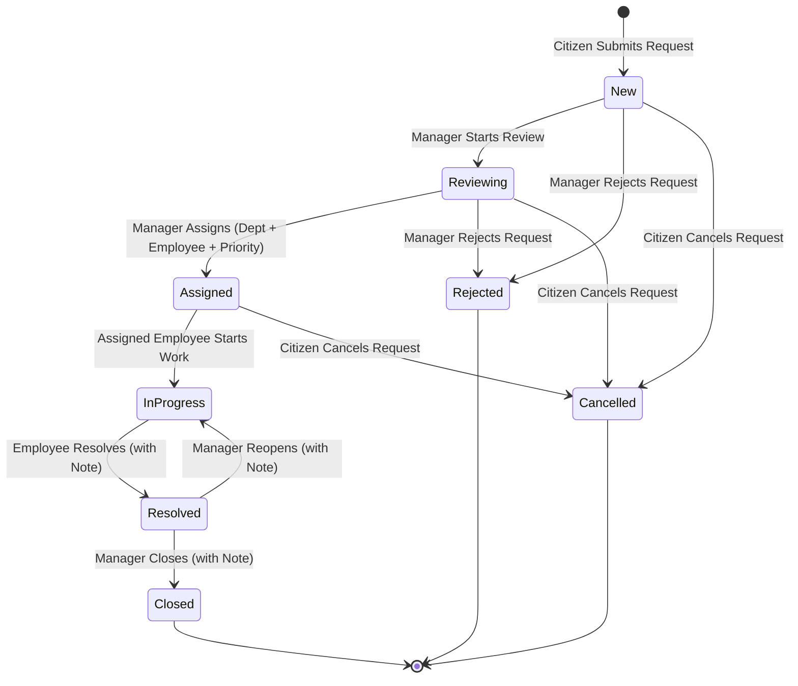

# Bursa City Service Management System (BCSMS)

[](https://dotnet.microsoft.com/)
[](https://react.dev/)
[](https://www.typescriptlang.org/)
[](https://www.microsoft.com/sql-server)
[](https://www.docker.com/)

A municipal citizen service and request management platform developed as a case study for **Bursa Metropolitan Municipality**.

The system streamlines citizen service requests from initial submission through municipal review, department assignment, field execution, resolution, and administrative closure.

---

## Complete Business Workflow

```
[Citizen] Submits Request ──► [Manager] Reviews ──► [Manager] Assigns Department & Employee
                                                                       │
[Citizen] Receives Update ◄── [Manager] Closes ◄── [Employee] Resolves ◄── [Employee] Starts Work
```

---

## Key Features

### Citizen Portal
- **Registration & Authentication**: Citizen self-registration with secure password validation.
- **Submit Service Requests**: Create requests selecting from active municipal categories (`Road and Pavement`, `Street Lighting`, `Waste and Cleaning`, `Parks`) with address and geographic coordinates.
- **My Requests & Tracking**: Filter personal requests by status and inspect detailed chronological process timelines.

### Manager Portal
- **Municipal Oversight**: Comprehensive dashboard with status metrics and a multi-filtered request table (Status, Category, Department, Priority).
- **Workflow Operations**: Start review (`New` $\rightarrow$ `Reviewing`), assign tasks to specific municipal departments and field staff with priority ratings (`Reviewing` $\rightarrow$ `Assigned`), reject non-qualifying requests (`Rejected`), reopen unresolved requests (`InProgress`), and officially close completed requests (`Closed`).

### Field Employee Portal
- **Task Management**: Dedicated view for requests assigned specifically to the authenticated employee.
- **Work Execution**: Transition assigned tasks to active progress (`Assigned` $\rightarrow$ `InProgress`) and submit resolution notes upon completion (`InProgress` $\rightarrow$ `Resolved`).

### Platform & Architecture
- **JWT Bearer Authentication**: Role-based access control (`Citizen`, `Manager`, `Employee`, `Admin`).
- **Audit & Timeline**: Immutable status transition history capturing actor IDs, timestamps, and notes.
- **Production-Grade Packaging**: Multi-stage Dockerfiles and Docker Compose orchestration with Nginx reverse proxy.
- **Standardized Error Handling**: RFC 7807 `ProblemDetails` translation across all API controllers.

---

## Architecture

BCSMS is designed in strict compliance with **Clean Architecture** (Ports & Adapters) principles:

```
BCSMS.API ───────► BCSMS.Application ◄─────── BCSMS.Infrastructure
                           │
                           ▼
                      BCSMS.Domain
```

- **`BCSMS.Domain`**: Core enterprise entities, value objects, domain exceptions, and invariant rules (zero external framework dependencies).
- **`BCSMS.Application`**: Use cases, command/query handlers, validation logic, repository contracts, and DTOs.
- **`BCSMS.Infrastructure`**: EF Core 8 database context (`BcsmsDbContext`), migrations, SQL Server repository implementations, PBKDF2 password hashing, and JWT token generation.
- **`BCSMS.API`**: ASP.NET Core Web API presentation layer, middleware, Swagger documentation, and health check endpoints.
- **`frontend/web`**: Single Page Application built with React 18, TypeScript, Material UI (MUI v5), and TanStack Query v5.

Detailed architecture diagrams and specifications are available in [docs/architecture/architecture.md](docs/architecture/architecture.md).

---

## Technology Stack

| Layer | Technologies |
|---|---|
| **Backend** | .NET 8, ASP.NET Core Web API, EF Core 8, SQL Server 2022, xUnit, FluentAssertions, Moq |
| **Frontend** | React 18, TypeScript 5.5, Vite 5, Material UI (MUI v5), React Router v6, Axios, TanStack Query v5, Vitest, React Testing Library |
| **Infrastructure** | Docker, Docker Compose, Nginx 1.27 Alpine |

---

## Domain Model & Database Schema

The persistence schema reflects the municipal service domain:

- **`Users`**: Authenticated platform accounts with roles (`Citizen`, `Manager`, `Employee`, `Admin`) and department associations.
- **`Departments`**: Operational municipal units (e.g., Fen İşleri, Park ve Bahçeler, Temizlik İşleri, Ulaşım).
- **`Categories`**: Service classifications for citizen requests.
- **`ServiceRequests`**: Core lifecycle entity with tracking code, citizen reference, category, assigned staff, coordinates, and notes.
- **`StatusHistoryEntries`**: Immutable audit logs capturing every status transition, actor ID, and note.
- **`Comments`** & **`Attachments`**: Discussion and metadata attachments linked to service requests.

Entity-Relationship diagrams and detailed schema documentation are available in [docs/database/er-diagram.md](docs/database/er-diagram.md).

---

## Request Lifecycle State Machine



Full state transition rules and role permissions are documented in [docs/business/request-workflow.md](docs/business/request-workflow.md).

---

## Security

- **Password Hashing**: Industry-standard PBKDF2 with HMAC-SHA512 using 100,000 iterations and unique cryptographic salt per user.
- **JWT Authorization**: Cryptographically signed HMAC-SHA256 bearer tokens with role claims.
- **Actor Enforcement**: Authenticated user IDs are derived strictly from server-validated JWT claims (`User.GetUserId()`), preventing client spoofing of `CitizenId`, `ManagerId`, or `EmployeeId`.
- **Environment Isolation**: All credentials in `.env.example` and repository configurations are clearly marked local development placeholders. Real `.env` files remain gitignored.

---

## Testing

The project maintains 100% test pass rates across both backend and frontend suites:

- **Backend Test Suite (76 Tests)**:
  - `BCSMS.UnitTests` (48 tests): Domain entity invariants, use case handlers, validation rules.
  - `BCSMS.IntegrationTests` (28 tests): ASP.NET Core `WebApplicationFactory` tests using persistent SQLite in-memory integration databases covering all endpoint controllers, role authorization, and the full end-to-end municipal lifecycle.
- **Frontend Test Suite (28 Tests)**:
  - Vitest + React Testing Library covering layout rendering, role guards, status/priority chips, error translation, and form validation.
- **Smoke Tests**: Validated live end-to-end workflow execution across containerized Nginx, Web API, and SQL Server services.

```bash
# Run Backend Tests
dotnet test backend/dotnet/BCSMS.sln

# Run Frontend Tests
cd frontend/web && npm test -- --run
```

---

## Running Locally with Docker

### Prerequisites
- [Docker](https://www.docker.com/) and [Docker Compose](https://docs.docker.com/compose/)

### Quick Start

1. Copy the example environment file:
   ```bash
   cp .env.example .env
   ```

2. Build and start all services:
   ```bash
   docker compose up --build -d
   ```

3. Open the application:
   - **Frontend Web Application**: [http://localhost:3000](http://localhost:3000)
   - **API Direct / Swagger UI**: [http://localhost:5123/swagger](http://localhost:5123/swagger)
   - **Health Endpoint**: [http://localhost:3000/health](http://localhost:3000/health) or [http://localhost:5123/health](http://localhost:5123/health)

### Managing Data Persistence
- **Stop services (preserving SQL database data)**:
  ```bash
  docker compose down
  ```
- **Stop services and remove SQL database volume**:
  ```bash
  docker compose down -v
  ```

---

## Demo Accounts

Deterministic development demo accounts seeded automatically for evaluation:

| Role | Email | Password | Department | Notes |
|---|---|---|---|---|
| **Manager** | `manager@bursa.bel.tr` | `Demo12345!` | Fen İşleri | Full review, assignment, closure rights |
| **Employee 1** | `employee1@bursa.bel.tr` | `Demo12345!` | Fen İşleri | Field worker for Fen İşleri tasks |
| **Employee 2** | `employee2@bursa.bel.tr` | `Demo12345!` | Park ve Bahçeler | Field worker for Park ve Bahçeler tasks |
| **Admin** | `admin@bursa.bel.tr` | `Demo12345!` | Administration | Platform administrator |
| **Citizen** | *(Self-register)* | *(Your Password)* | N/A | Register directly from [http://localhost:3000/register](http://localhost:3000/register) |

> [!NOTE]
> All passwords above are strictly local development credentials.

---

## Project Structure

```
BursaCityServiceManagement/
├── backend/
│   └── dotnet/
│       ├── src/
│       │   ├── BCSMS.Domain/            # Domain entities, enums, value objects
│       │   ├── BCSMS.Application/       # Use cases, commands, queries, DTOs
│       │   ├── BCSMS.Infrastructure/    # EF Core, SQL Server, security services
│       │   └── BCSMS.API/               # Controllers, middleware, program entry
│       └── tests/
│           ├── BCSMS.UnitTests/         # Domain and application unit tests
│           └── BCSMS.IntegrationTests/  # Integration tests with WebApplicationFactory
├── frontend/
│   └── web/                             # React 18 + TypeScript + Vite SPA
├── docs/
│   ├── architecture/                    # System architecture diagrams & design
│   ├── database/                        # Database schema & ER diagrams
│   ├── business/                        # Municipal workflow state machines
│   └── api/                             # RESTful API endpoint specifications
├── docker/
│   ├── dotnet/                          # Multi-stage .NET 8 Dockerfile
│   └── frontend/                        # Multi-stage Node + Nginx Dockerfile
├── .env.example                         # Safe development environment template
├── docker-compose.yml                   # Multi-container orchestration
└── README.md
```

---

## API Overview

Detailed endpoint documentation is available in [docs/api/api-overview.md](docs/api/api-overview.md) and via Swagger UI (`/swagger`).

- **`/api/auth`**: User registration and JWT login.
- **`/api/service-requests`**: Citizen request creation, personal request listing, and detailed timeline queries.
- **`/api/manager/service-requests`**: Manager municipal overview, review, department/employee assignment, rejection, reopening, and closure.
- **`/api/employee/service-requests`**: Field employee assigned task listing, work initiation, and resolution.
- **`/api/categories` & `/api/departments`**: Reference lookups for forms and cascading dropdown filters.

---

## Known Limitations & Future Roadmap

The following capabilities are designated for future phases:

- **Refresh Tokens & Sliding Sessions**: Extended token lifecycle management with secure HTTP-only refresh tokens.
- **Real-Time Citizen Notifications**: Email and SMS alerts for status changes via integration with municipal messaging gateways.
- **Binary File Uploads**: Direct image and document attachment storage in S3 / Azure Blob Storage.
- **SLA & Escalation Engine**: Automated threshold tracking and overdue escalation for high-priority service requests.
- **e-Devlet / KPS Integration**: Identity verification with the Turkish Republic Central Civil Registration System (MERNIS/KPS).
- **Alternative Java Backend**: Implementation of equivalent Clean Architecture services in Java Spring Boot.

---

## License

This project is licensed under the MIT License. See [LICENSE](LICENSE) for details.
