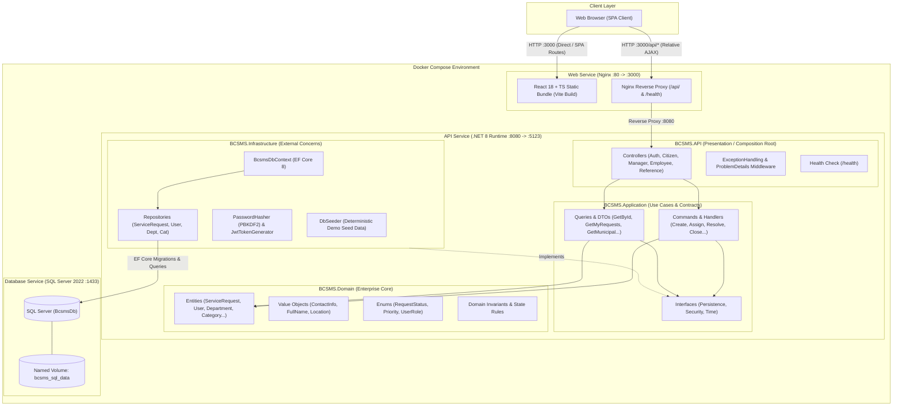

# System Architecture

The **Bursa City Service Management System (BCSMS)** is built following the principles of **Clean Architecture** (Ports & Adapters / Hexagonal Architecture). This design strictly enforces separation of concerns and dependency inversion, ensuring core business logic remains independent of UI frameworks, databases, and third-party libraries.

---

## 1. High-Level Architecture Diagram



---

## 2. Layer Responsibilities

### `BCSMS.Domain`
- **Zero External Dependencies**: Contains pure C# domain entities, value objects, domain exceptions, and enums.
- **Enterprise Invariants**: Encapsulates entity lifecycles, validation rules, and status transition constraints.
- **Key Types**: `ServiceRequest`, `User`, `Department`, `Category`, `StatusHistoryEntry`, `Comment`, `Attachment`, `FullName`, `ContactInfo`, `RequestStatus`, `Priority`, `UserRole`.

### `BCSMS.Application`
- **Use Case Orchestration**: Implements business workflows and commands (`CreateServiceRequest`, `AssignRequest`, `StartWork`, `ResolveRequest`, `CloseRequest`, etc.).
- **Boundary Abstractions**: Declares repository contracts (`IServiceRequestRepository`, `IUserRepository`, `IDepartmentRepository`, `ICategoryRepository`), time abstractions (`IClock`), and security contracts (`IPasswordHasher`, `IJwtTokenGenerator`).
- **DTOs and Mappings**: Encapsulates query models (`ServiceRequestDetailDto`, `PagedResult<T>`) without exposing raw database entities.

### `BCSMS.Infrastructure`
- **Persistence Layer**: Entity Framework Core 8 implementation (`BcsmsDbContext`), fluent entity configurations, migrations, and repository implementations.
- **Security Implementations**: PBKDF2 with HMAC-SHA512 password hashing (`PasswordHasher`) and signed HMAC-SHA256 JWT generation (`JwtTokenGenerator`).
- **Database Seeding**: Idempotent development data seeder (`DbSeeder`).

### `BCSMS.API`
- **Composition Root**: Configures ASP.NET Core dependency injection container, authentication schemes, CORS, and routing.
- **Controllers & Endpoints**: Exposes RESTful HTTP endpoints grouped by municipal role (`AuthController`, `ServiceRequestsController`, `ManagerServiceRequestsController`, `EmployeeServiceRequestsController`, `ReferenceDataController`).
- **Error Handling**: RFC 7807 `ProblemDetails` translation via `ExceptionHandlingMiddleware`.
- **Operational Endpoints**: Built-in `/health` check.

### `frontend/web` (Client Layer)
- **Framework & Language**: React 18, TypeScript, Vite.
- **UI & Layout System**: Material UI (MUI v5) tailored with municipal visual hierarchy.
- **Server State & Routing**: TanStack Query v5 for cached server synchronization and React Router v6 with `ProtectedRoute` role guards.
- **Deployment**: Static build served via Nginx with SPA fallback (`try_files`) and `/api/` reverse proxy.

---

## 3. Dependency Rule

```
BCSMS.API ───────► BCSMS.Application ◄─────── BCSMS.Infrastructure
                           │
                           ▼
                      BCSMS.Domain
```

All dependencies point inwards toward the Domain model. Neither `BCSMS.Domain` nor `BCSMS.Application` depends on EF Core, ASP.NET Core, or SQL Server.
