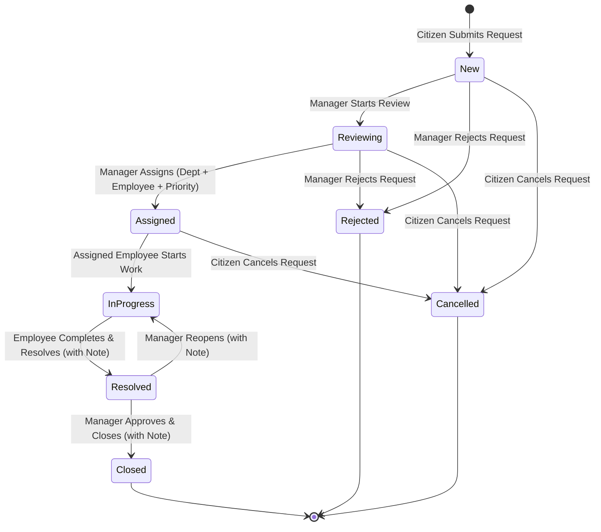

# Municipal Service Request Lifecycle & Business Workflow

This document specifies the business lifecycle, role permissions, and state transition rules for municipal service requests in the **Bursa City Service Management System (BCSMS)**.

---

## 1. Lifecycle State Machine Diagram

---

## 2. State Transition Matrix

| Current State | Target State | Authorized Role | Required Inputs | Business Rule / Side Effect |
|---|---|---|---|---|
| *(None)* | **`New`** | **Citizen** | Title, CategoryId, Description, Address, Coordinates | Initial state upon creation; tracking code generated; audit log created. |
| **`New`** | **`Reviewing`** | **Manager** | None | Manager acknowledges request and begins evaluation. |
| **`Reviewing`** | **`Assigned`** | **Manager** | DepartmentId, EmployeeId, Priority | Request assigned to responsible operational department and field staff with priority level. |
| **`Assigned`** | **`InProgress`** | **Employee** | None | Assigned employee begins field maintenance/repair. Must be the assigned employee. |
| **`InProgress`** | **`Resolved`** | **Employee** | Resolution Note | Work completed; resolution note recorded for municipal audit and citizen inspection. |
| **`Resolved`** | **`Closed`** | **Manager** | Closure Note (Optional) | Manager verifies resolution in the field and officially closes the request. (Terminal state) |
| **`Resolved`** | **`InProgress`** | **Manager** | Reopen Note | Work deemed incomplete or unsatisfactory; sent back to employee for additional maintenance. |
| **`New`** / **`Reviewing`** | **`Rejected`** | **Manager** | Rejection Reason | Request determined outside municipal jurisdiction, spam, or invalid. (Terminal state) |
| **`New`** / **`Reviewing`** / **`Assigned`** | **`Cancelled`** | **Citizen** | Cancellation Reason | Citizen withdraws their request before work begins. (Terminal state) |

---

## 3. Role Responsibilities Summary

### Citizen
- **Registration & Profile**: Create account with email verification and secure password.
- **Request Creation**: Submit service requests choosing from active municipal categories (`Road and Pavement`, `Street Lighting`, `Waste and Cleaning`, `Parks`).
- **Tracking & History**: View personal requests list, status chips, coordinates, and full chronological audit timeline.

### Manager
- **Municipal Oversight**: Filter across all requests by Status, Category, Department, and Priority.
- **Workflow Control**: Start review, assign to specific department staff with priority rating, reject non-qualifying requests, reopen unresolved work, and officially close verified requests.

### Field Employee
- **Task Execution**: View tasks specifically assigned to them.
- **State Progression**: Transition assigned requests to `InProgress` upon starting work, and to `Resolved` upon completing maintenance along with a resolution summary.
