# Database Schema & Entity-Relationship (ER) Model

This document outlines the database schema and table relationships for the **Bursa City Service Management System (BCSMS)** backed by PostgreSQL 16 (and Neon PostgreSQL) and managed via Entity Framework Core migrations.

---

## 1. Entity-Relationship Diagram

```mermaid
erDiagram
    Departments ||--o{ Users : "employs"
    Departments ||--o{ ServiceRequests : "assigned_to_department"
    Categories ||--o{ ServiceRequests : "categorizes"
    Users ||--o{ ServiceRequests : "creates (Citizen)"
    Users ||--o{ ServiceRequests : "assigned_to (Employee)"
    Users ||--o{ StatusHistoryEntries : "changed_by"
    Users ||--o{ Comments : "authored_by"
    Users ||--o{ Attachments : "uploaded_by"

    ServiceRequests ||--o{ StatusHistoryEntries : "tracks_history"
    ServiceRequests ||--o{ Comments : "contains"
    ServiceRequests ||--o{ Attachments : "includes"

    Departments {
        uniqueidentifier Id PK
        nvarchar_200 Name
        nvarchar_1000 Description
        bit IsActive
        datetime2 CreatedAt
        datetime2 UpdatedAt
    }

    Categories {
        uniqueidentifier Id PK
        nvarchar_200 Name
        nvarchar_1000 Description
        bit IsActive
        datetime2 CreatedAt
        datetime2 UpdatedAt
    }

    Users {
        uniqueidentifier Id PK
        nvarchar_100 FirstName
        nvarchar_100 LastName
        nvarchar_256 Email UK
        nvarchar_30 PhoneNumber
        nvarchar_500 PasswordHash
        nvarchar_30 Role
        uniqueidentifier DepartmentId FK
        bit IsActive
        datetime2 CreatedAt
        datetime2 UpdatedAt
    }

    ServiceRequests {
        uniqueidentifier Id PK
        nvarchar_50 TrackingCode UK
        uniqueidentifier CitizenId FK
        uniqueidentifier CategoryId FK
        nvarchar_200 Title
        nvarchar_max Description
        nvarchar_30 Status
        nvarchar_30 Priority
        uniqueidentifier AssignedDepartmentId FK
        uniqueidentifier AssignedEmployeeId FK
        nvarchar_max ResolutionNote
        nvarchar_max ClosureNote
        nvarchar_max RejectionReason
        nvarchar_max CancellationReason
        float Latitude
        float Longitude
        nvarchar_500 AddressText
        datetime2 CreatedAt
        datetime2 UpdatedAt
    }

    StatusHistoryEntries {
        uniqueidentifier Id PK
        uniqueidentifier ServiceRequestId FK
        nvarchar_30 OldStatus
        nvarchar_30 NewStatus
        nvarchar_1000 Note
        uniqueidentifier ChangedByUserId FK
        datetime2 ChangedAt
    }

    Comments {
        uniqueidentifier Id PK
        uniqueidentifier ServiceRequestId FK
        uniqueidentifier AuthorUserId FK
        nvarchar_max Content
        datetime2 CreatedAt
    }

    Attachments {
        uniqueidentifier Id PK
        uniqueidentifier ServiceRequestId FK
        nvarchar_255 FileName
        nvarchar_500 FilePath
        nvarchar_100 ContentType
        bigint FileSizeBytes
        uniqueidentifier UploadedByUserId FK
        datetime2 UploadedAt
    }
```

---

## 2. Table Specifications

### `Departments`
Stores municipal operating departments (e.g., Fen İşleri, Park ve Bahçeler, Temizlik İşleri, Ulaşım).
- `Id` (`uniqueidentifier`, PK)
- `Name` (`nvarchar(200)`, required, unique)
- `Description` (`nvarchar(1000)`, optional)
- `IsActive` (`bit`, default true)
- `CreatedAt`, `UpdatedAt` (`datetime2`)

### `Categories`
Defines service request classifications (e.g., Road and Pavement, Street Lighting, Waste and Cleaning, Parks).
- `Id` (`uniqueidentifier`, PK)
- `Name` (`nvarchar(200)`, required, unique)
- `Description` (`nvarchar(1000)`, optional)
- `IsActive` (`bit`, default true)
- `CreatedAt`, `UpdatedAt` (`datetime2`)

### `Users`
Centralized authentication and profile table for all platform roles (`Citizen`, `Manager`, `Employee`, `Admin`).
- `Id` (`uniqueidentifier`, PK)
- `FirstName`, `LastName` (`nvarchar(100)`, required)
- `Email` (`nvarchar(256)`, required, unique index)
- `PhoneNumber` (`nvarchar(30)`, optional)
- `PasswordHash` (`nvarchar(500)`, PBKDF2 hash)
- `Role` (`nvarchar(30)`, string enum value)
- `DepartmentId` (`uniqueidentifier`, FK to `Departments`, nullable for Citizens and Admins)
- `IsActive` (`bit`, default true)
- `CreatedAt`, `UpdatedAt` (`datetime2`)

### `ServiceRequests`
Core municipal request entity tracking the full lifecycle, citizen author, department assignment, and notes.
- `Id` (`uniqueidentifier`, PK)
- `TrackingCode` (`nvarchar(50)`, unique formatted tracking reference)
- `CitizenId` (`uniqueidentifier`, FK to `Users`)
- `CategoryId` (`uniqueidentifier`, FK to `Categories`)
- `Title` (`nvarchar(200)`, required)
- `Description` (`nvarchar(max)`, optional)
- `Status` (`nvarchar(30)`, string enum: `New`, `Reviewing`, `Assigned`, `InProgress`, `Resolved`, `Closed`, `Rejected`, `Cancelled`)
- `Priority` (`nvarchar(30)`, string enum: `Low`, `Medium`, `High`, `Critical`, nullable)
- `AssignedDepartmentId` (`uniqueidentifier`, FK to `Departments`, nullable)
- `AssignedEmployeeId` (`uniqueidentifier`, FK to `Users`, nullable)
- `ResolutionNote` (`nvarchar(max)`, nullable, populated on resolution)
- `ClosureNote` (`nvarchar(max)`, nullable, populated on closure)
- `RejectionReason` (`nvarchar(max)`, nullable, populated on rejection)
- `CancellationReason` (`nvarchar(max)`, nullable, populated on cancellation)
- `Latitude`, `Longitude` (`float`, nullable geographic coordinates)
- `AddressText` (`nvarchar(500)`, nullable address description)
- `CreatedAt`, `UpdatedAt` (`datetime2`)

### `StatusHistoryEntries`
Immutable audit log tracking every state transition, timestamp, actor ID, and optional note.
- `Id` (`uniqueidentifier`, PK)
- `ServiceRequestId` (`uniqueidentifier`, FK to `ServiceRequests`)
- `OldStatus`, `NewStatus` (`nvarchar(30)`, string enums)
- `Note` (`nvarchar(1000)`, optional)
- `ChangedByUserId` (`uniqueidentifier`, FK to `Users`)
- `ChangedAt` (`datetime2`)

### `Comments`
Audit / discussion notes attached to service requests.
- `Id` (`uniqueidentifier`, PK)
- `ServiceRequestId` (`uniqueidentifier`, FK to `ServiceRequests`)
- `AuthorUserId` (`uniqueidentifier`, FK to `Users`)
- `Content` (`nvarchar(max)`, required)
- `CreatedAt` (`datetime2`)

### `Attachments`
Metadata for files uploaded in connection with a service request.
- `Id` (`uniqueidentifier`, PK)
- `ServiceRequestId` (`uniqueidentifier`, FK to `ServiceRequests`)
- `FileName` (`nvarchar(255)`)
- `FilePath` (`nvarchar(500)`)
- `ContentType` (`nvarchar(100)`)
- `FileSizeBytes` (`bigint`)
- `UploadedByUserId` (`uniqueidentifier`, FK to `Users`)
- `UploadedAt` (`datetime2`)
